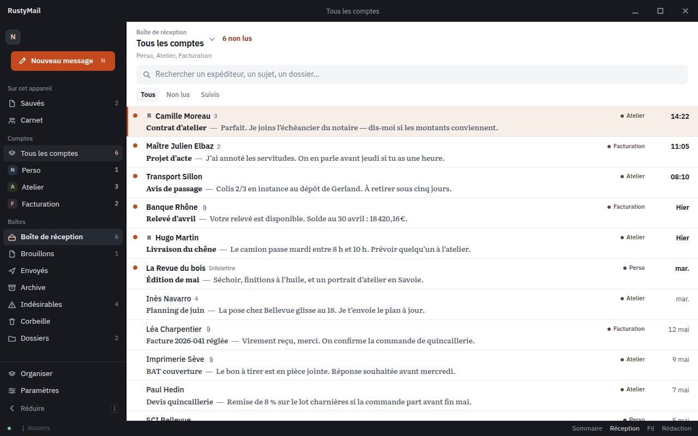
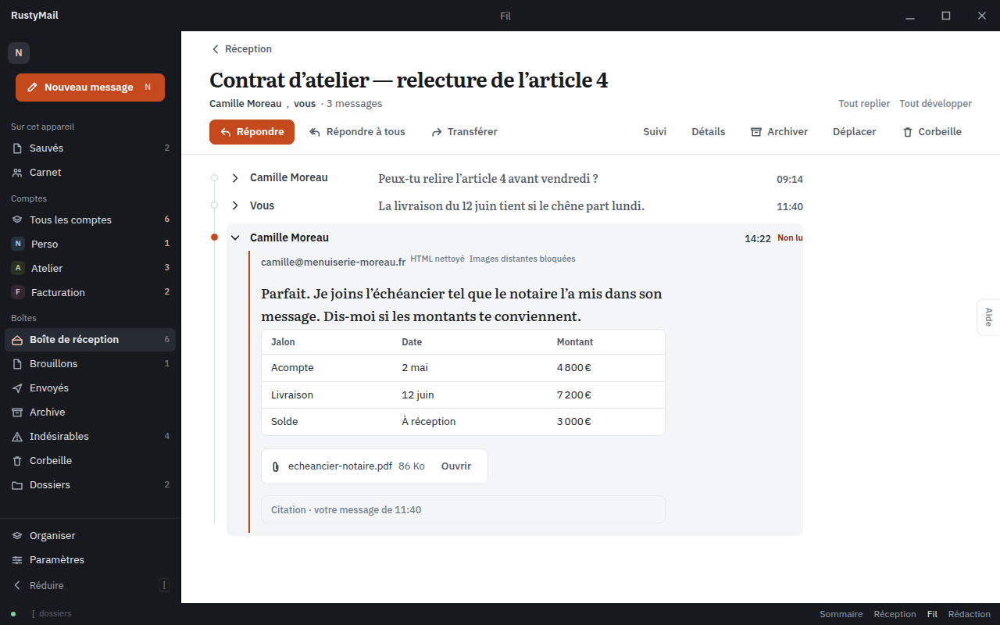
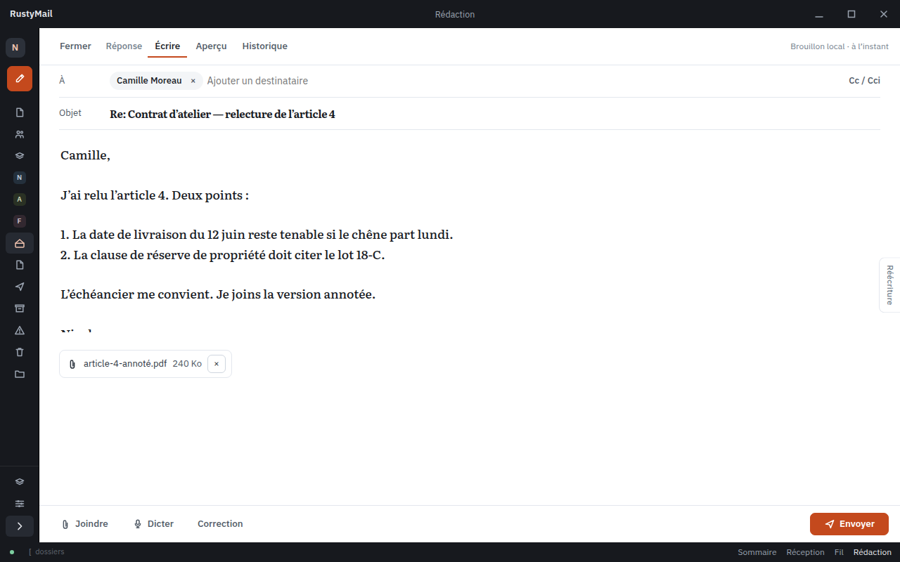

# RustyMail

RustyMail is a **local-first desktop email client** built with **Tauri v2**, **Rust**, and **TypeScript**. It syncs mail over **IMAP**, sends over **SMTP**, caches state in **SQLite**, and keeps credentials in the **OS keyring**. Optional AI (summaries, rewrite, translation, grammar, dictation, semantic search) runs on-device or over HTTP to OpenRouter / llama-server — never required for core mail.

**0.3.9** follows 0.3.8: multi-account compose « De » (send + draft save on the same account), toolbar dictate/IA row, summary LLM context fit + empty fallback, status footer / UI polish, demo account helpers.

## Screenshots

UI previews rendered from the productivity mockups in [`docs/mockups/productivity/`](docs/mockups/productivity/README.md). The mail is fictional demo content. These frames show the intended shell; they are not a pixel-perfect capture of the 0.3.9 build (compose in the app uses TipTap, not the mockup’s markdown field).

**Inbox** — unified list, charcoal rail, account labels.



**Thread reading** — messages fold; the latest reply stays open.



**Compose** — writing with the folder rail collapsed.



## Quick start

```bash
npm install
npm run tauri:dev
```

Web-only UI (no desktop shell):

```bash
npm run dev
```

Compile check (Rust workspace):

```bash
npm run verify:compile
```

**Prerequisites:** Node.js 22+, Rust stable, platform Tauri dependencies. See [Development](docs/DEVELOPMENT.md).

## Documentation

Full index: **[docs/README.md](docs/README.md)**

| Topic | Guide |
| ----- | ----- |
| Architecture | [docs/ARCHITECTURE.md](docs/ARCHITECTURE.md) |
| Development & tests | [docs/DEVELOPMENT.md](docs/DEVELOPMENT.md) |
| Preferences & storage | [docs/CONFIGURATION.md](docs/CONFIGURATION.md) |
| Mail accounts | [docs/ACCOUNTS.md](docs/ACCOUNTS.md) |
| OAuth (developers) | [docs/OAUTH.md](docs/OAUTH.md) |
| AI & models | [docs/AI_AND_MODELS.md](docs/AI_AND_MODELS.md) |
| LLM JSON contracts | [docs/LLM_CONTRACTS.md](docs/LLM_CONTRACTS.md) |
| Security & privacy | [docs/SECURITY.md](docs/SECURITY.md) |
| IPC / Tauri commands | [docs/IPC_SECURITY.md](docs/IPC_SECURITY.md) |
| Feature matrix | [docs/CAPABILITIES.md](docs/CAPABILITIES.md) |
| Product vision | [docs/PRODUCT.md](docs/PRODUCT.md) |
| UI design | [docs/DESIGN.md](docs/DESIGN.md) — productivity direction. Wave 1+2 shell is in the app: charcoal, white, copper, rail, multi-account pills, thread accordion |
| Releases & CI | [docs/RELEASE.md](docs/RELEASE.md) |
| Contributing | [docs/CONTRIBUTING.md](docs/CONTRIBUTING.md) |

## Architecture (summary)

```text
crates/
  rustymail-domain/          Account, message, thread, draft, tag, search types
  rustymail-application/     Workflows: list/search/open thread, compose, send
  rustymail-infrastructure/  SQLite, IMAP/SMTP, keyring, search, prefs, OAuth helpers
  rustymail-modules/         Readability pipeline, mail cleaning, security heuristics, AI modules
  rustymail-llm/             HTTP LLM client (OpenRouter, OpenAI-compatible servers)
  rustymail-semantic/        MiniLM embeddings (ONNX)
src-tauri/                   Tauri shell, invoke commands, model bootstrap, IMAP IDLE
src/                         Vite + TypeScript UI (does not own mail logic)
```

The **frontend calls Tauri commands**; Rust delegates to `rustymail-application` and infrastructure adapters. See [ARCHITECTURE.md](docs/ARCHITECTURE.md).

## First launch

1. **Light models** (MiniLM ~90 MB, Whisper tiny) download automatically in the background.
2. A **minimal welcome dialog** offers optional **llama-server** install via winget (Windows).
3. Everything else — accounts, API keys, mother language, chat GGUF — is configured in **Settings**.

See [AI_AND_MODELS.md](docs/AI_AND_MODELS.md) and [CONFIGURATION.md](docs/CONFIGURATION.md).

## Developer OAuth

Copy [`.env.example`](.env.example) to `.env` at the repo root (debug builds only). Set placeholders such as `RUSTYMAIL_GOOGLE_OAUTH_CLIENT_ID` — never commit real secrets. See [OAUTH.md](docs/OAUTH.md).

## Release

Tag `v*` (e.g. `v0.1.1`) to trigger the GitHub Actions release workflow (Windows NSIS/MSI). Local build: `npm run tauri:build`. See [RELEASE.md](docs/RELEASE.md).

## License

MIT — see crate manifests for details.
